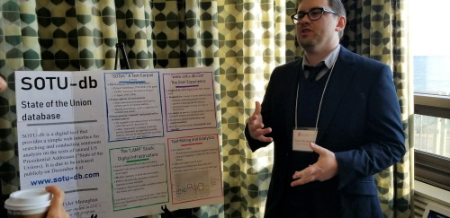

*[back to tylermonaghan.dev](index.md)*  

# Development Portfolio
This page contains links to repos, projects and blogs related to software development.  
## Project Lead
### SOTU-db
*Creator and project manager; LAMP Stack and R*   
SOTU-db (State of the Union Database) web interface for running sentiment and other textual analyses on US State of the Union addresses.  
- [SOTU-db](http://www.sotu-db.com) - the live SOTU-db homepage (alpha release - functionality might be broken or absent)  
- [development blog](http://blog.sotu-db.com) - for behind-the-scenes project details and updates  
- [capstone defense](https://luc.hosted.panopto.com/Panopto/Pages/Viewer.aspx?id=a156a239-eef4-411f-bb3e-a9ac014af9a9) - a video of my defense of SOTU-db at Loyola University Chicago's Center for Textual Studies and Digital Humanities

### Archive Buddy
*Creator, MIT App Inventor*  
Prototype mobile app for researchers working with archival materials to find, photograph, tag, and sort source materials, developed in consultation with Loyola University Chicago archivists.
- [GitHub repo](https://github.com/tymonaghan/archive-buddy) (contains link to .apk Android package - requires sideloading - use at your own risk)
- [demo video](https://youtu.be/-juLrUvyT34)

### Pie Chaser
*Creator; Processing*  
Consume slices of pizza and pumpkin pie to avoid dying.
- [Pie Chaser repo on GitHub](https://github.com/tymonaghan/pie-chaser)

### Tic Tac Tohmygod
*Creator, Processing*  
Cyber-electronic radical version of tic tac toe.
- [Tic Tac Tohmygod repo on GitHub](https://github.com/tymonaghan/tic-tac-tohmygod)

### Clothes Picker
*Creator, Processing*  
Use a weather API to help my wonderful wife decide what to wear.
- [Clothes Picker repo on GitHub](https://github.com/tymonaghan/clothes-picker)  

## Collaborations
### Lili Elbe Digital Archive
*encoder, design contributor:*  
A digital archive of Lili Elbe's life narrative, "the first popular and well-documented narrative of genital transformation surgery," published under the title *Man Into Woman*. I had the opportunity to assist with textual encoding for this impressive project. I also contributed to the design of the website by authoring an HTML mockup and participating in the collaborative revision process.  
- [Lili Elbe Digital Archive](http://www.lilielbe.org)