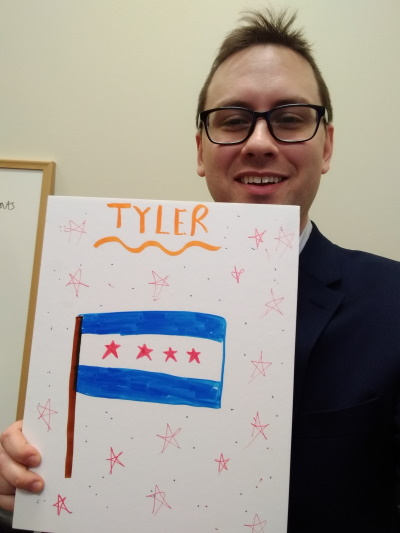

*[back to tylermonaghan.dev](index.md)*

### Explore Common Sense
A digital edition of the British version of Thomas Paine's *Common Sense,* by Kate Johnson, Marie Pellissier, and Kelly Schmidt. I had the opportunity to author the Teacher's Guide that accompanies this wonderful project.
- [Explore Common Sense Website](http://explorecommonsense.com)
- [Teacher's Guide](http://explorecommonsense.com/files/original/38314501a25ab0d085beefd635aef247.pdf)

### Gettysburg Address Scholarly Edition
A print scholarly edition of US President Abraham Lincoln's Gettysburg Address. Completed for Dr. Paul Eggert's Textual Criticism course at Loyola University Chicago.
- [Scholarly edition of Lincoln's Gettysburg Address](docs/Lincoln-Gettysburg-scholarly-ed-by-TMonaghan.pdf) printable as a mini-book, includes facsimiles and apparatus of multiple editions of the Gettysburg Address

------

### essays

[ Leisure in America](docs/LeisureInAmerica.pdf) historiographical essay for History of Urban America course

[ Chicago's Black "Ghetto"](docs/Chicago-Ghetto-historiography.pdf) historiographical essay for African-American Chicago course

### blogs

[Digital Humonaghan](https://dh400monaghan.wordpress.com/) DH blog for Introduction to DH Design & Programming

[SOTU-db dev blog](http://blog.sotu-db.com/) documenting the State of the Union Database project

### instructional

["Archive Buddy" demo](https://youtu.be/-juLrUvyT34) demo video for prototype mobile app for researchers conducting archival research

[Explore Common Sense lesson plans](http://explorecommonsense.com/educators) package of lesson plans designed around the "Explore Common Sense" digital edition (Click the "PDF Teacher's Guide" link)

[November 30, 2018 CTSDH server workshop PPT](humanities-server-workshop.pptx) workshop on why and how to create one's own server that can host a basic web page

### other
["Rambling" grant proposal](docs/rambling-grant-proposal.pdf) a draft NEH grant proposal to fund an AR/360-photo tour of Loyola University Chicago's campus